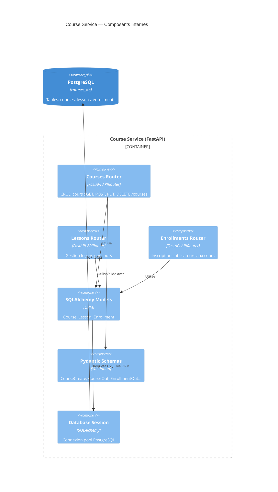
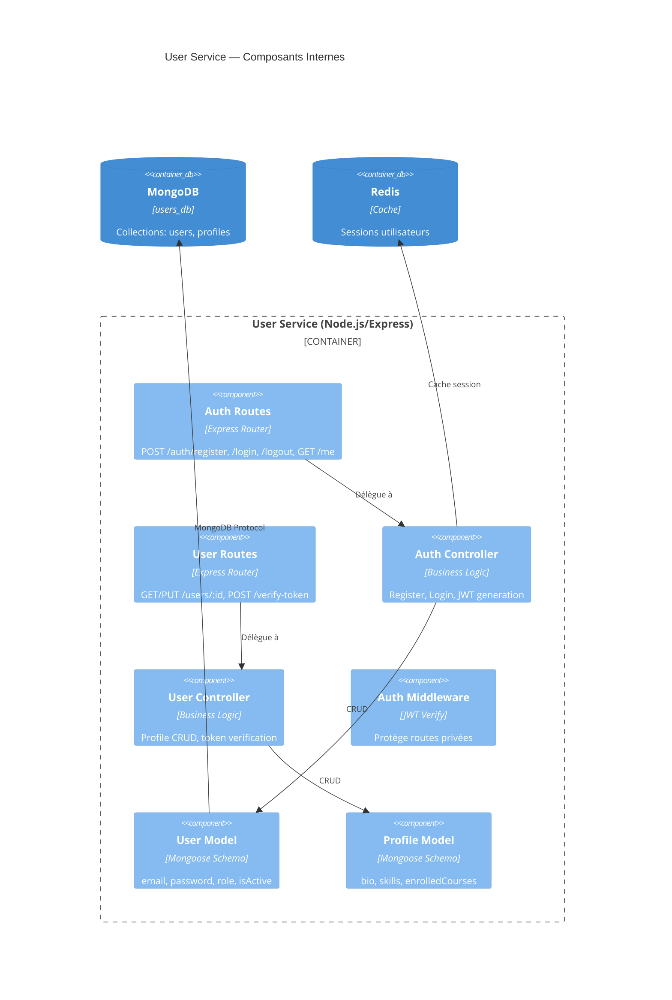

# C4 Model — Niveau 3 : Component Diagram

## Course Service

```mermaid
C4Component
    title Course Service — Composants Internes

    Container_Boundary(cs, "Course Service (FastAPI)") {
        Component(router_c, "Courses Router", "FastAPI APIRouter", "CRUD cours : GET, POST, PUT, DELETE /courses")
        Component(router_l, "Lessons Router", "FastAPI APIRouter", "Gestion leçons par cours")
        Component(router_e, "Enrollments Router", "FastAPI APIRouter", "Inscriptions utilisateurs aux cours")
        Component(models, "SQLAlchemy Models", "ORM", "Course, Lesson, Enrollment")
        Component(schemas, "Pydantic Schemas", "Validation", "CourseCreate, CourseOut, EnrollmentOut...")
        Component(db, "Database Session", "SQLAlchemy", "Connexion pool PostgreSQL")
    }

    ContainerDb(postgres, "PostgreSQL", "courses_db", "Tables: courses, lessons, enrollments")

    Rel(router_c, models, "Utilise")
    Rel(router_l, models, "Utilise")
    Rel(router_e, models, "Utilise")
    Rel(models, db, "Requêtes SQL via ORM")
    Rel(router_c, schemas, "Valide avec")
    Rel(db, postgres, "TCP :5432")
```

## User Service

```mermaid
C4Component
    title User Service — Composants Internes

    Container_Boundary(us, "User Service (Node.js/Express)") {
        Component(auth_r, "Auth Routes", "Express Router", "POST /auth/register, /login, /logout, GET /me")
        Component(user_r, "User Routes", "Express Router", "GET/PUT /users/:id, POST /verify-token")
        Component(auth_ctrl, "Auth Controller", "Business Logic", "Register, Login, JWT generation")
        Component(user_ctrl, "User Controller", "Business Logic", "Profile CRUD, token verification")
        Component(auth_mw, "Auth Middleware", "JWT Verify", "Protège routes privées")
        Component(user_model, "User Model", "Mongoose Schema", "email, password, role, isActive")
        Component(profile_model, "Profile Model", "Mongoose Schema", "bio, skills, enrolledCourses")
    }

    ContainerDb(mongo, "MongoDB", "users_db", "Collections: users, profiles")
    ContainerDb(redis, "Redis", "Cache", "Sessions utilisateurs")

    Rel(auth_r, auth_ctrl, "Délègue à")
    Rel(user_r, user_ctrl, "Délègue à")
    Rel(auth_ctrl, user_model, "CRUD")
    Rel(user_ctrl, profile_model, "CRUD")
    Rel(auth_ctrl, redis, "Cache session")
    Rel(user_model, mongo, "MongoDB Protocol")
```