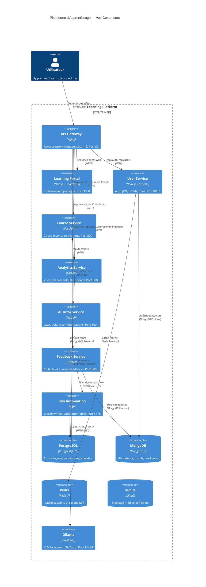

# C4 Model — Niveau 2 : Container Diagram

```mermaid
C4Container
    title Plateforme d'Apprentissage — Vue Conteneurs

    Person(user, "Utilisateur", "Apprenant / Instructeur / Admin")

    Container_Boundary(platform, "Learning Platform") {
        Container(nginx, "API Gateway", "Nginx", "Reverse proxy, routage, sécurité. Port 80")
        Container(frontend, "Learning Portal", "Next.js + shadcn/ui", "Interface web publique. Port 3000")

        Container(user_svc, "User Service", "Node.js / Express", "Auth JWT, profils, rôles. Port 8002")
        Container(course_svc, "Course Service", "FastAPI", "Cours, leçons, inscriptions. Port 8001")
        Container(analytics_svc, "Analytics Service", "FastAPI", "Vues, événements, dashboard. Port 8003")
        Container(ai_svc, "AI Tutor Service", "FastAPI", "Q&A, quiz, recommandations. Port 8004")
        Container(feedback_svc, "Feedback Service", "FastAPI", "Collecte et analyse feedbacks. Port 8005")
        Container(n8n, "n8n Automation", "n8n", "Workflow feedback automatisé. Port 5678")

        ContainerDb(postgres, "PostgreSQL", "PostgreSQL 16", "Cours, leçons, inscriptions, analytics")
        ContainerDb(mongodb, "MongoDB", "MongoDB 7", "Utilisateurs, profils, feedbacks")
        ContainerDb(redis, "Redis", "Redis 7", "Cache sessions et tokens JWT")
        ContainerDb(minio, "MinIO", "MinIO", "Stockage médias et fichiers")
        Container(ollama, "Ollama", "tinyllama", "LLM local pour l'IA Tutor. Port 11434")
    }

    Rel(user, nginx, "Toutes les requêtes", "HTTPS :80")
    Rel(nginx, frontend, "Requêtes pages web", "HTTP")
    Rel(nginx, user_svc, "/api/auth, /api/users", "HTTP")
    Rel(nginx, course_svc, "/api/courses, /api/enrollments", "HTTP")
    Rel(nginx, analytics_svc, "/api/events, /api/dashboard", "HTTP")
    Rel(nginx, ai_svc, "/api/chat, /api/quiz, /api/recommendations", "HTTP")
    Rel(nginx, feedback_svc, "/api/feedback", "HTTP")

    Rel(user_svc, mongodb, "Lit/Écrit utilisateurs", "MongoDB Protocol")
    Rel(user_svc, redis, "Cache tokens", "Redis Protocol")
    Rel(course_svc, postgres, "Lit/Écrit cours", "PostgreSQL Protocol")
    Rel(analytics_svc, postgres, "Lit/Écrit events", "PostgreSQL Protocol")
    Rel(feedback_svc, mongodb, "Stocke feedbacks", "MongoDB Protocol")
    Rel(feedback_svc, n8n, "Déclenche workflow", "Webhook HTTP")
    Rel(ai_svc, ollama, "Génère réponses IA", "HTTP REST")
    Rel(ai_svc, course_svc, "Récupère cours", "HTTP REST")
```