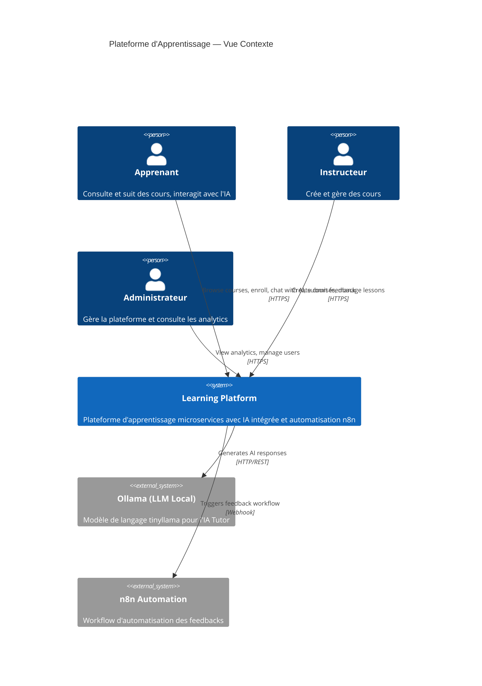

# C4 Model — Niveau 1 : Context Diagram

```mermaid
C4Context
    title Plateforme d'Apprentissage — Vue Contexte

    Person(student, "Apprenant", "Consulte et suit des cours, interagit avec l'IA")
    Person(instructor, "Instructeur", "Crée et gère des cours")
    Person(admin, "Administrateur", "Gère la plateforme et consulte les analytics")

    System(platform, "Learning Platform", "Plateforme d'apprentissage microservices avec IA intégrée et automatisation n8n")

    System_Ext(ollama, "Ollama (LLM Local)", "Modèle de langage tinyllama pour l'IA Tutor")
    System_Ext(n8n, "n8n Automation", "Workflow d'automatisation des feedbacks")

    Rel(student, platform, "Browse courses, enroll, chat with AI, submit feedback", "HTTPS")
    Rel(instructor, platform, "Create courses, manage lessons", "HTTPS")
    Rel(admin, platform, "View analytics, manage users", "HTTPS")
    Rel(platform, ollama, "Generates AI responses", "HTTP/REST")
    Rel(platform, n8n, "Triggers feedback workflow", "Webhook")
```