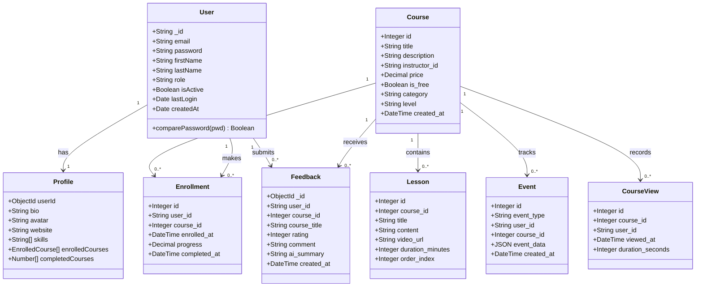

# UML — Class Diagram

```mermaid
classDiagram
    class User {
        +String _id
        +String email
        +String password
        +String firstName
        +String lastName
        +String role
        +Boolean isActive
        +Date lastLogin
        +Date createdAt
        +comparePassword(pwd) Boolean
    }

    class Profile {
        +ObjectId userId
        +String bio
        +String avatar
        +String website
        +String[] skills
        +EnrolledCourse[] enrolledCourses
        +Number[] completedCourses
    }

    class Course {
        +Integer id
        +String title
        +String description
        +String instructor_id
        +Decimal price
        +Boolean is_free
        +String category
        +String level
        +DateTime created_at
    }

    class Lesson {
        +Integer id
        +Integer course_id
        +String title
        +String content
        +String video_url
        +Integer duration_minutes
        +Integer order_index
    }

    class Enrollment {
        +Integer id
        +String user_id
        +Integer course_id
        +DateTime enrolled_at
        +Decimal progress
        +DateTime completed_at
    }

    class Event {
        +Integer id
        +String event_type
        +String user_id
        +Integer course_id
        +JSON event_data
        +DateTime created_at
    }

    class Feedback {
        +ObjectId _id
        +String user_id
        +Integer course_id
        +String course_title
        +Integer rating
        +String comment
        +String ai_summary
        +DateTime created_at
    }

    class CourseView {
        +Integer id
        +Integer course_id
        +String user_id
        +DateTime viewed_at
        +Integer duration_seconds
    }

    User "1" --> "1" Profile : has
    Course "1" --> "0..*" Lesson : contains
    Course "1" --> "0..*" Enrollment : has
    User "1" --> "0..*" Enrollment : makes
    User "1" --> "0..*" Feedback : submits
    Course "1" --> "0..*" Feedback : receives
    Course "1" --> "0..*" Event : tracks
    Course "1" --> "0..*" CourseView : records
```