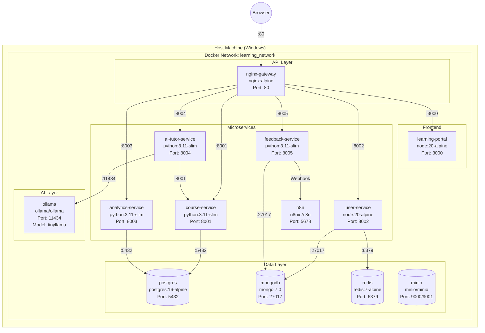

# UML — Deployment Diagram

```mermaid
graph TB
    subgraph "Host Machine (Windows)"
        subgraph "Docker Network: learning_network"

            subgraph "API Layer"
                NGINX[nginx-gateway<br/>nginx:alpine<br/>Port: 80]
            end

            subgraph "Frontend"
                FE[learning-portal<br/>node:20-alpine<br/>Port: 3000]
            end

            subgraph "Microservices"
                US[user-service<br/>node:20-alpine<br/>Port: 8002]
                CS[course-service<br/>python:3.11-slim<br/>Port: 8001]
                AS[analytics-service<br/>python:3.11-slim<br/>Port: 8003]
                AI[ai-tutor-service<br/>python:3.11-slim<br/>Port: 8004]
                FS[feedback-service<br/>python:3.11-slim<br/>Port: 8005]
                N8N[n8n<br/>n8nio/n8n<br/>Port: 5678]
            end

            subgraph "Data Layer"
                PG[(postgres<br/>postgres:16-alpine<br/>Port: 5432)]
                MG[(mongodb<br/>mongo:7.0<br/>Port: 27017)]
                RD[(redis<br/>redis:7-alpine<br/>Port: 6379)]
                MN[(minio<br/>minio/minio<br/>Port: 9000/9001)]
            end

            subgraph "AI Layer"
                OL[ollama<br/>ollama/ollama<br/>Port: 11434<br/>Model: tinyllama]
            end
        end
    end

    Browser((Browser)) -->|:80| NGINX
    NGINX -->|:3000| FE
    NGINX -->|:8002| US
    NGINX -->|:8001| CS
    NGINX -->|:8003| AS
    NGINX -->|:8004| AI
    NGINX -->|:8005| FS

    US -->|:27017| MG
    US -->|:6379| RD
    CS -->|:5432| PG
    AS -->|:5432| PG
    FS -->|:27017| MG
    FS -->|Webhook| N8N
    AI -->|:11434| OL
    AI -->|:8001| CS
```