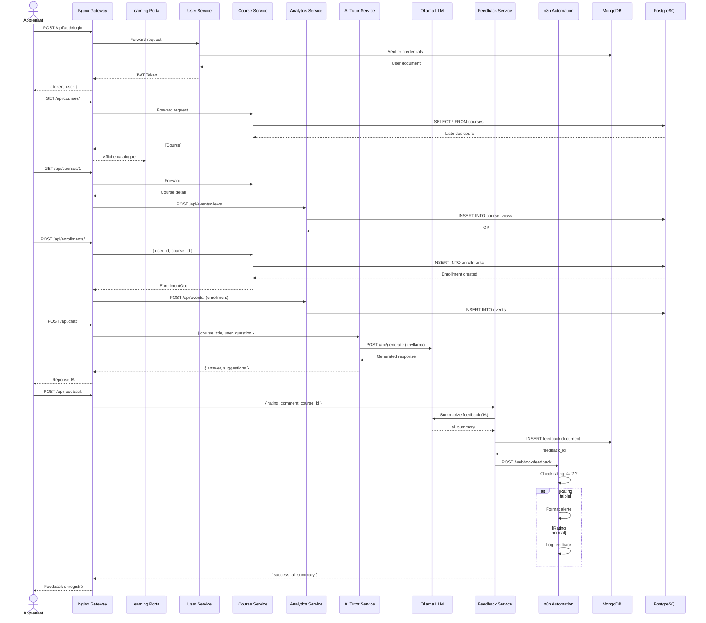

# UML — Sequence Diagram

## Flux complet : Inscription → Cours → IA → Feedback → n8n

```mermaid
sequenceDiagram
    actor Student as Apprenant
    participant GW as Nginx Gateway
    participant FE as Learning Portal
    participant US as User Service
    participant CS as Course Service
    participant AN as Analytics Service
    participant AI as AI Tutor Service
    participant OL as Ollama LLM
    participant FS as Feedback Service
    participant N8N as n8n Automation
    participant MG as MongoDB
    participant PG as PostgreSQL

    %% 1. Authentification
    Student->>GW: POST /api/auth/login
    GW->>US: Forward request
    US->>MG: Vérifier credentials
    MG-->>US: User document
    US-->>GW: JWT Token
    GW-->>Student: { token, user }

    %% 2. Parcourir les cours
    Student->>GW: GET /api/courses/
    GW->>CS: Forward request
    CS->>PG: SELECT * FROM courses
    PG-->>CS: Liste des cours
    CS-->>GW: [Course]
    GW-->>FE: Affiche catalogue

    %% 3. Voir un cours (tracking)
    Student->>GW: GET /api/courses/1
    GW->>CS: Forward
    CS-->>GW: Course détail
    GW->>AN: POST /api/events/views
    AN->>PG: INSERT INTO course_views
    PG-->>AN: OK

    %% 4. S'inscrire
    Student->>GW: POST /api/enrollments/
    GW->>CS: { user_id, course_id }
    CS->>PG: INSERT INTO enrollments
    PG-->>CS: Enrollment created
    CS-->>GW: EnrollmentOut
    GW->>AN: POST /api/events/ (enrollment)
    AN->>PG: INSERT INTO events

    %% 5. Question à l'IA
    Student->>GW: POST /api/chat/
    GW->>AI: { course_title, user_question }
    AI->>OL: POST /api/generate (tinyllama)
    OL-->>AI: Generated response
    AI-->>GW: { answer, suggestions }
    GW-->>Student: Réponse IA

    %% 6. Feedback + n8n
    Student->>GW: POST /api/feedback
    GW->>FS: { rating, comment, course_id }
    FS->>OL: Summarize feedback (IA)
    OL-->>FS: ai_summary
    FS->>MG: INSERT feedback document
    MG-->>FS: feedback_id
    FS->>N8N: POST /webhook/feedback
    N8N->>N8N: Check rating <= 2 ?
    alt Rating faible
        N8N->>N8N: Format alerte
    else Rating normal
        N8N->>N8N: Log feedback
    end
    FS-->>GW: { success, ai_summary }
    GW-->>Student: Feedback enregistré
```