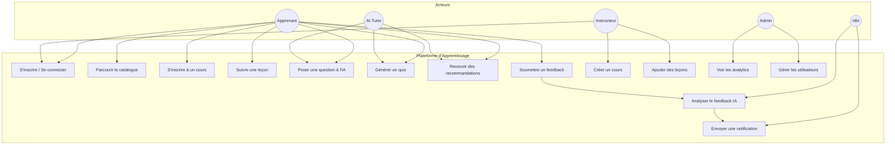

# UML — Use Case Diagram

```mermaid
graph TB
    subgraph Acteurs
        S((Apprenant))
        I((Instructeur))
        A((Admin))
        AI((AI Tutor))
        N8N((n8n))
    end

    subgraph "Plateforme d'Apprentissage"
        UC1[S'inscrire / Se connecter]
        UC2[Parcourir le catalogue]
        UC3[S'inscrire à un cours]
        UC4[Suivre une leçon]
        UC5[Poser une question à l'IA]
        UC6[Générer un quiz]
        UC7[Recevoir des recommandations]
        UC8[Soumettre un feedback]
        UC9[Créer un cours]
        UC10[Ajouter des leçons]
        UC11[Voir les analytics]
        UC12[Gérer les utilisateurs]
        UC13[Analyser le feedback IA]
        UC14[Envoyer une notification]
    end

    S --> UC1
    S --> UC2
    S --> UC3
    S --> UC4
    S --> UC5
    S --> UC6
    S --> UC7
    S --> UC8

    I --> UC1
    I --> UC9
    I --> UC10

    A --> UC11
    A --> UC12

    AI --> UC5
    AI --> UC6
    AI --> UC7

    N8N --> UC13
    N8N --> UC14

    UC8 --> UC13
    UC13 --> UC14
```